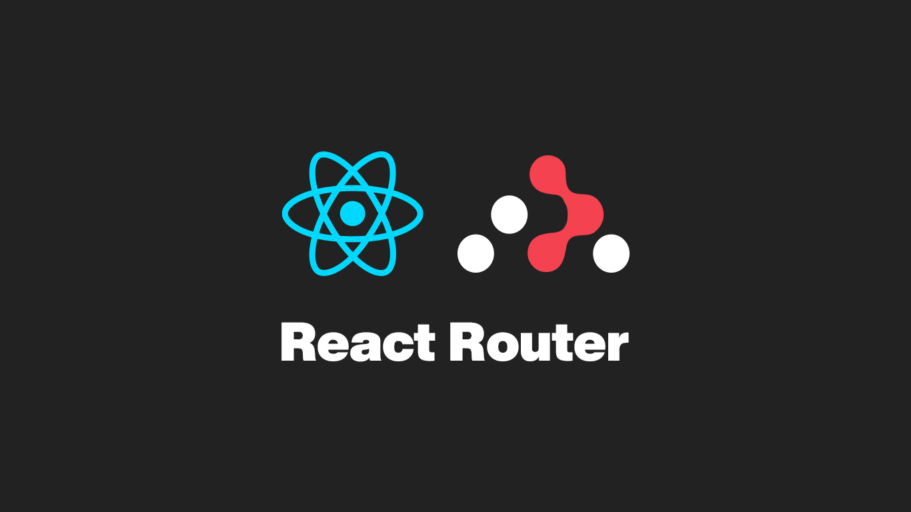

# React + TypeScript + Vite

## **Desafio: Rotas React**

O desafio é um projeto ReactJS conforme design Figma abaixo.

<https://www.figma.com/file/5cPiXC5sBQc4B4wIZKlI3i/Desafio-Rotas-React>

O projeto deve ser criado usando o Vite.

## Critérios de correção

Todos critérios a seguir devem ser contemplados:

1. Três links da barra de navegação superior funcionando (Início, Produtos, Sobre nós).
2. Rota ativa da barra superior destacada na barra superior.
3. Link "home" (casinha no canto superior direito) funcionando.
4. Três links da barra de navegação de produtos funcionando (Computadores, Eletrônicos, Livros).
5. Rota ativa da barra de navegação de produtos destacada.
6. Página "Não encontrado" deve aparecer para qualquer rota não configurada.
7. As rotas, bem como as pastas dos componentes, devem seguir a seguinte hierarquia:
    - "/"
       - "home"
       - "products/"
         - "computers"
         - "electronics"
         - "books"
       - "about"  

&nbsp;

